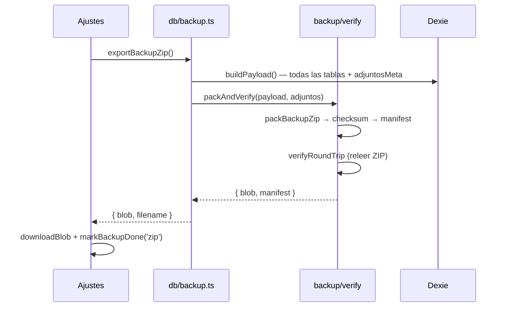
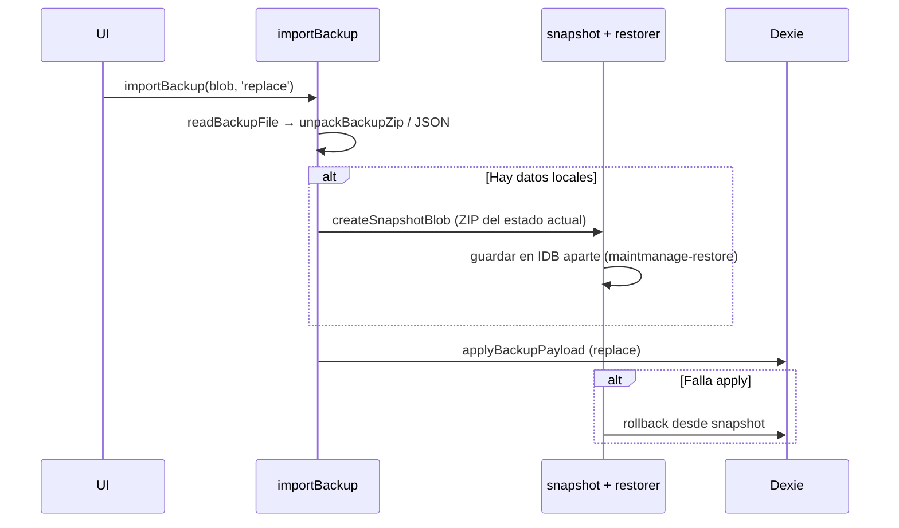
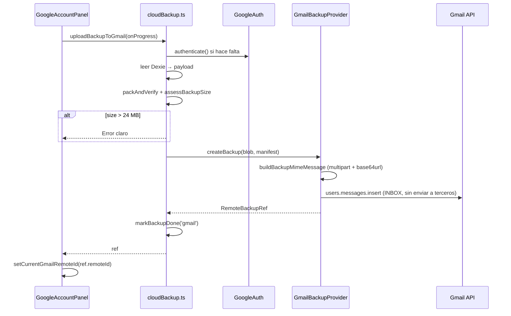
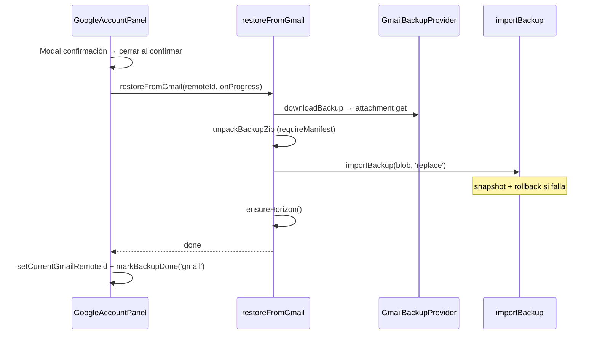

# Copias de seguridad — diseño e implementación

Documento de referencia para entender, mantener y extender el sistema de backup de MaintManage.

**Principio:** IndexedDB (Dexie) sigue siendo la fuente de verdad local. Gmail y los archivos ZIP/JSON/carpeta son **copias de respaldo**, no reemplazan la base de datos.

---

## Resumen ejecutivo

| Canal | Qué guarda | Usuario toca archivos | Estado |
|-------|-------------|----------------------|--------|
| **Carpeta** (File System Access) | ZIP completo con fotos | Elige carpeta una vez | ✅ |
| **ZIP / JSON** (descarga) | ZIP completo o solo datos | Descarga manual | ✅ |
| **Gmail** (OAuth + API) | ZIP como adjunto en el buzón | Solo «Crear copia» / «Restaurar» | ✅ |
| **Auto-backup** al abrir app | Carpeta o aviso de descarga | Banner «Guardar copia ahora» | ✅ parcial |

Producción: [https://ronnysandoval.github.io/maintmanage](https://ronnysandoval.github.io/maintmanage)

---

## Arquitectura en capas

```
┌─────────────────────────────────────────────────────────────┐
│  UI                                                          │
│  Ajustes.tsx · RestorePanel · GoogleAccountPanel · Layout   │
│  DataProcessOverlay · useDataProcess                          │
└───────────────────────────┬─────────────────────────────────┘
                            │
┌───────────────────────────▼─────────────────────────────────┐
│  Orquestación                                                │
│  src/db/backup.ts        export/import local, carpeta         │
│  src/backup/cloudBackup.ts   upload/list/restore Gmail        │
│  src/lib/autoBackup.ts   copia automática al abrir            │
└───────────────────────────┬─────────────────────────────────┘
                            │
┌───────────────────────────▼─────────────────────────────────┐
│  Empaquetado e integridad (src/backup/)                      │
│  package · manifest · checksum · validator · verify           │
│  limits · snapshot · restorer                                 │
└───────────────────────────┬─────────────────────────────────┘
                            │
┌───────────────────────────▼─────────────────────────────────┐
│  Proveedor remoto (src/google/)                              │
│  GoogleAuth · GmailClient · GmailBackupProvider               │
└───────────────────────────┬─────────────────────────────────┘
                            │
                     Gmail API (messages.insert / list / attachments.get)
```

### Regla de dependencias

- `src/backup/*` **no** importa React ni Gmail directamente (salvo `cloudBackup.ts`, que es el puente).
- `src/google/*` implementa `BackupProvider` definido en `src/backup/provider.ts`.
- `src/db/backup.ts` usa `packAndVerify` / `unpackBackupZip` / `replaceWithRollback`.

---

## Formato del paquete ZIP

Cada copia «completa» es un ZIP con tres piezas:

| Entrada en ZIP | Archivo | Contenido |
|----------------|---------|-----------|
| Datos | `backup.json` | Payload serializado (`version: 1`) |
| Adjuntos | `files/{id}` | Blobs de fotos/documentos |
| Metadatos | `manifest.json` | IDs, checksum, dispositivo, tamaño |

Constantes en `src/backup/types.ts`:

- `BACKUP_FORMAT_VERSION = 1`
- `SCHEMA_VERSION = 10` (alineado con Dexie)
- `GMAIL_BACKUP_SUBJECT_TAG = '[MAINTMANAGE_BACKUP]'`

### Manifest (campos clave)

```json
{
  "backupId": "BACKUP-20260915-010203-abcdef",
  "createdAt": "2026-09-15T01:02:03.456Z",
  "checksum": "<sha256 hex del contenido>",
  "size": 11123456,
  "deviceId": "<uuid persistente en localStorage>",
  "deviceName": "Chrome · Android",
  "platform": "android",
  "kind": "manual",
  "schemaVersion": 10,
  "attachmentCount": 42,
  "dataVersion": 1726350000000
}
```

El **checksum** cubre `backup.json` + todos los `files/*`, **no** el manifest (el manifest se valida aparte).

### Copias legacy

ZIP antiguos sin `manifest.json` siguen importándose (`legacy: true` en el validador). Las copias nuevas **exigen** manifest en flujos Gmail y restore seguro.

---

## Flujo 1 — Crear copia local (ZIP)

**Entrada UI:** Ajustes → Copia → Descargar ZIP  
**Código:** `exportBackupZip()` en `src/db/backup.ts`



**Pasos internos de `packAndVerify`:**

1. Serializar tablas a `BackupPayload`.
2. Comprimir con JSZip (`backup.json` + `files/{id}`).
3. Calcular SHA-256 del contenido (`checksum.ts`).
4. Escribir `manifest.json`.
5. Reabrir el ZIP y validar integridad (`verifyRoundTrip`).

---

## Flujo 2 — Importar / restaurar local

**Entrada UI:** Ajustes → Recuperar · `RestorePanel` al primer uso  
**Código:** `importBackup(file, mode)` en `src/db/backup.ts`

### Modo `replace` (reemplazo total)



### Modo `merge`

Fusiona registros por `id` sin snapshot (los del archivo pisan locales si coinciden).

Tras cualquier restore: `ensureHorizon()` recalcula ocurrencias futuras.

---

## Flujo 3 — Crear copia en Gmail

**Entrada UI:** Ajustes → Cuenta Google → «Crear copia ahora»  
**Código:** `uploadBackupToGmail()` → `GmailBackupProvider.createBackup()`



### Progreso UI (`CloudBackupProgress`)

| Paso | Significado |
|------|-------------|
| `preparing` | OAuth + lectura IndexedDB |
| `compressing` | `packAndVerify` |
| `uploading` | `messages.insert` |
| `done` / `error` | Fin (overlay muestra resultado) |

### Mensaje en Gmail

- **Asunto:** `[MAINTMANAGE_BACKUP] {ISO} {backupId}`
- **Cuerpo:** texto legible + bloque `MAINTMANAGE_BACKUP_META` + JSON con metadatos.
- **Adjunto:** `maintmanage-{backupId}.zip`

Búsqueda al listar: `subject:"[MAINTMANAGE_BACKUP]"`.

---

## Flujo 4 — Listar copias Gmail

**Entrada UI:** «Ver copias»  
**Código:** `listGmailBackups()` → `GmailBackupProvider.listBackups()`

1. `GmailClient.listMessageIds(query, 40)`.
2. Por cada mensaje: `getMessage(id, 'full')`.
3. `messageToRemoteRef`: parsea meta del cuerpo o fallback del asunto.
4. Orden descendente por `createdAt`.

### «Copia actual» en la lista

`src/lib/gmailCurrentBackup.ts` guarda en `localStorage` el `remoteId` de la última copia **subida o restaurada** en este dispositivo.

La card con borde neón «Copia actual» aparece cuando:

- `backup.remoteId === getCurrentGmailRemoteId()`, **y**
- no hay cambios pendientes (`lastChangedAt <= lastBackupAt`).

---

## Flujo 5 — Restaurar desde Gmail

**Entrada UI:** «Restaurar» en una card → modal de confirmación → overlay de progreso  
**Código:** `restoreFromGmail(remoteId)` en `src/backup/cloudBackup.ts`



### Progreso UI (`CloudRestoreProgress`)

| Paso | Significado |
|------|-------------|
| `downloading` | Descarga adjunto ZIP |
| `validating` | `unpackBackupZip` + checksum |
| `restoring` | `importBackup` replace |
| `done` / `error` | Overlay de éxito o error |

**Importante:** la modal «¿Restaurar esta copia?» se cierra **al confirmar**, antes del overlay. El overlay de resultado usa `useDataProcess` con fase `outcome` (icono ✓/✗ + «Entendido»).

---

## Flujo 6 — Copia automática al abrir

**Código:** `src/lib/autoBackup.ts` + banner en `Layout.tsx`

1. Al montar layout y al volver `visibilityState === 'visible'`: `runAutoBackupIfDue()`.
2. Si `autoBackup === false` o no hay datos → skip.
3. Si hay carpeta vinculada y toca copia → `writeBackupToFolder`.
4. Si no hay carpeta → banner «Guarda una copia ahora» (ZIP manual).

Criterio «toca copia»: `lastChangedAt > lastBackupAt` y `now >= nextBackupAt`.

---

## Capa UI — overlay de procesos

Todos los flujos de datos largos usan el mismo patrón:

| Pieza | Archivo | Rol |
|-------|---------|-----|
| Hook | `src/hooks/useDataProcess.ts` | `run({ title, steps, work, successMessage… })` |
| Overlay | `src/components/DataProcessOverlay.tsx` | Modal blur + barra + pasos + resultado |
| Progreso suave | `src/hooks/useSmoothProgress.ts` | Avance animado por tramos (sin % real) |
| Definición pasos | `src/lib/dataProcess.ts` | `GMAIL_UPLOAD_STEPS`, `IMPORT_STEPS`, etc. |

Ciclo de `run()`:

1. Fase `running` — pasos con barra indeterminada suavizada.
2. Animación al 100 % (`completing: true`).
3. Fase `outcome` — éxito o error con auto-cierre (~3,4 s) o botón «Entendido».

---

## Mapa de módulos

### `src/backup/`

| Archivo | Responsabilidad |
|---------|-----------------|
| `types.ts` | Constantes y tipos del formato |
| `payload.ts` | Shape de `backup.json` |
| `checksum.ts` | SHA-256 del contenido |
| `manifest.ts` | Crear/parsear `manifest.json`, `createBackupId` |
| `package.ts` | `packBackupZip` / `unpackBackupZip` (JSZip) |
| `validator.ts` | Validación estructural + checksum |
| `verify.ts` | `packAndVerify`, `verifyRoundTrip` |
| `limits.ts` | Umbrales Gmail (18 MB warn, 24 MB hard) |
| `snapshot.ts` | Store IDB `maintmanage-restore` para rollback |
| `restorer.ts` | `replaceWithRollback` |
| `device.ts` | `deviceId` persistente, nombre legible |
| `provider.ts` | Interfaz `BackupProvider` + `RemoteBackupRef` |
| `cloudBackup.ts` | Orquestación Gmail (upload/list/restore) |

### `src/google/`

| Archivo | Responsabilidad |
|---------|-----------------|
| `config.ts` | Resolución Client ID (env → json → bundled) |
| `bundledClientId.ts` | ID embebido para PWA cacheada en Pages |
| `GoogleAuth.ts` | GIS Token model; access token en localStorage hasta caducar |
| `GmailClient.ts` | Fetch wrapper Gmail REST v1 |
| `mime.ts` | Construcción MIME multipart para insert |
| `GmailBackupProvider.ts` | Implementación `BackupProvider` |

### `src/db/backup.ts`

Export/import local, carpeta (File System Access), share, `markBackupDone`, intervalos.

### Tests

```bash
npm test
```

| Suite | Qué cubre |
|-------|-----------|
| `src/backup/package.test.ts` | Checksum, manifest, ZIP, corrupción |
| `src/backup/phase2.test.ts` | Round-trip, snapshot, rollback |
| `src/backup/cloudBackup.test.ts` | `restoreFromGmail` con mocks |
| `src/google/GoogleAuth.test.ts` | OAuth estados |
| `src/google/GmailBackupProvider.test.ts` | MIME, list, parse meta |

---

## Configuración Google Cloud

### 1. Proyecto y APIs

1. [Google Cloud Console](https://console.cloud.google.com/) → nuevo proyecto o existente.
2. **APIs y servicios → Biblioteca** → habilitar **Gmail API**.

### 2. Pantalla de consentimiento OAuth

- Tipo: **Externa** (o Interna si Workspace).
- Scopes: `openid`, `email`, `https://www.googleapis.com/auth/gmail.modify`.
- En **Testing**: añadir cada Gmail que vaya a probar como **usuario de prueba**.

### 3. Credencial OAuth «Aplicación web»

**Orígenes JavaScript autorizados** (sin path; Google no acepta `/maintmanage`):

```
http://localhost:5173
http://127.0.0.1:5173
https://ronnysandoval.github.io
```

La app vive en `https://ronnysandoval.github.io/maintmanage` pero el origen OAuth es solo el dominio.

### 4. Client ID en la app

Orden de resolución (`src/google/config.ts`):

1. `VITE_GOOGLE_CLIENT_ID` en `.env.local` (desarrollo).
2. `public/google-oauth.json` en runtime (Pages, sin recompilar).
3. `src/google/bundledClientId.ts` (fallback PWA cacheada).

CI: secret `VITE_GOOGLE_CLIENT_ID` en `.github/workflows/deploy.yml`.

### 5. Errores frecuentes

| Síntoma | Causa | Solución |
|---------|-------|----------|
| `origin_mismatch` | Origen no registrado | Añadir origen exacto (sin `/maintmanage`) |
| `access_denied` 403 | Usuario no tester | Añadir en OAuth consent screen |
| «Copia en Google no configurada» en móvil | PWA con JS viejo | Forzar actualización / reinstalar PWA |
| Token caducado (~1 h) | Sin refresh token (by design) | «Volver a conectar» (la recarga no desconecta si el token sigue válido) |

---

## Límites y decisiones técnicas

| Tema | Decisión |
|------|----------|
| OAuth | GIS Token model — **sin** refresh token, **sin** backend; sesión persistida en `localStorage` (~1 h) |
| Tamaño Gmail | Hard max ~24 MB; warn ~18 MB |
| Cifrado | No (Fase 8 opcional: AES-GCM) |
| Retención Gmail | No se borran copias antiguas automáticamente (futuro: últimos N) |
| PWA cerrada | No hay backup en background; al reabrir se evalúa pendiente |
| IndexedDB | Nunca se sustituye; solo export/import |

---

## Cómo extender el sistema

### Añadir un nuevo proveedor (p. ej. Drive)

1. Implementar `BackupProvider` en `src/backup/provider.ts`.
2. Crear `DriveBackupProvider.ts` con upload/list/download.
3. Añadir funciones en un `cloudBackup`-like o generalizar el existente.
4. UI en `GoogleAccountPanel` o panel nuevo.

### Añadir backup automático Gmail (Fase 6)

1. En `runAutoBackupIfDue`, si conectado a Google y hay cambios → `uploadBackupToGmail`.
2. Comparar `dataVersion` / checksum con última copia para skip si idéntica.
3. Respetar token OAuth (gesto si expirado).

### Añadir indicador de sync (Fase 7)

Estados sugeridos: ☁️ sincronizado · pendiente · error · desconectado.  
Fuente: `lastBackupAt`, `lastBackupKind`, `lastChangedAt`, estado `GoogleAuth`.

---

## Fases — estado

| Fase | Descripción | Estado |
|------|-------------|--------|
| 1 | Modelo ZIP + manifest + checksum | ✅ |
| 2 | verify, límites, snapshot, rollback | ✅ |
| 3 | Google OAuth (GIS) | ✅ |
| 4 | Gmail API upload/list | ✅ |
| 5 | Restore seguro desde lista | ✅ |
| 6 | Backup automático Gmail + skip checksum | ⬜ |
| 7 | Indicador sync global | ⬜ |
| 8 | Cifrado + Drive fallback | ⬜ opcional |

**UX reciente (incluida en código, no en fases originales):**

- Overlay de progreso con blur y resultado éxito/error.
- Lista Gmail en cards + «Copia actual» con borde neón.
- Modal de confirmación restore con aviso explícito.

---

## Criterios de aceptación

1. PC crea copia Gmail → móvil restaura con fotos sin manejar archivos.
2. Móvil → PC igual.
3. Restore fallido no deja datos corruptos (rollback).
4. Copia corrupta rechazada antes de escribir en Dexie.
5. Sin Google configurado, flujos ZIP/carpeta/JSON siguen funcionando.

---

## Referencia rápida — puntos de entrada

```typescript
// Local
import { exportBackupZip, importBackup, saveBackupNow } from './db/backup'

// Gmail
import {
  uploadBackupToGmail,
  listGmailBackups,
  restoreFromGmail,
} from './backup'

// UI Google
import { GoogleAccountPanel } from './components/GoogleAccountPanel'

// Progreso
import { useDataProcess } from './hooks/useDataProcess'
```

Para depurar un restore Gmail en tests, ver `src/backup/cloudBackup.test.ts` y el patrón `RestoreFromGmailDeps` (inyectar download/import mock).
